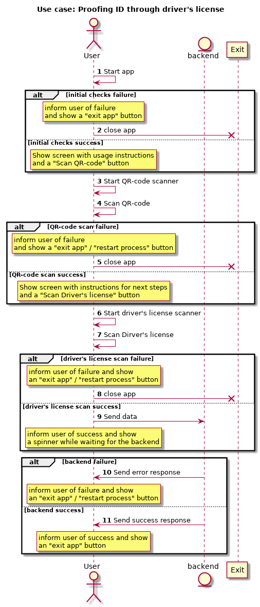

# NSTIC February demo use case

From the perspective of the mobile app, without distinguishing different parts in the backend.

## Preconditions:

* User has created an account and wants to proof the identity associated with the account.
* User has a QR-code with a nonce that identifies the created account (and possibly some additional data)

## Diagram

## User stories

1. As a user, I want to start the app, so that initialization checks all conditions needed for the app to work
2. Initialization failure
  * 2a. As a user, when some necessary initial condition is irrecoverably absent, I want to be shown information about it, and a button to exit the app, so that I can use other means to fix the problem.
  * 2b. As a user, when some necessary initial condition is recoverably absent, I want to be shown information about it, and a button to restart the initialization, so that I can fix the problem and restart the process.
3. Initialization success
  * 3a. As a user, when all initial conditions are given, I want the app to start the QR-code scanner, so that I can feed it the QR-code I had in my possesion.
4. As a user, I want to scan my QR-code, so that the app gathers the needed information about my account.
5. QR-code scan failure
  * 5a  & 5b like 2a & 2b
6. QR-code scan success
  * 6a. As a user, when the QR-scan has been successful, I want the app to start the driver's license scanner, so I can feed it my driver's license.
7. As a user, I want to scan my driver's license, so that the app gathers enough information to identify me.
8. Driver's license scan failure
  * 8a  & 8b like 2a & 2b
  * 8c. As a user, when the scan is successful, I want to be informed of such.
9. As a user, when the app has my identification data and my account data, I want it to send that information, so that my account is vetted.
10. Vetting fails
  * 10a & 10b as 2a & 2b
11. As a user, when the vetting process finishes successfully, I want to be informed of it.

